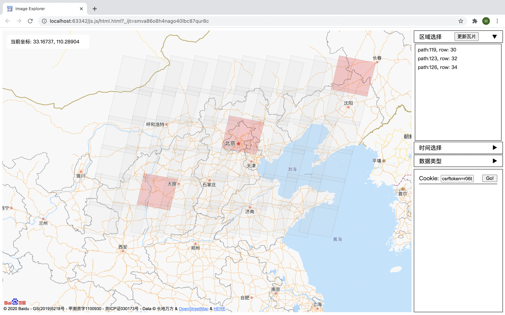
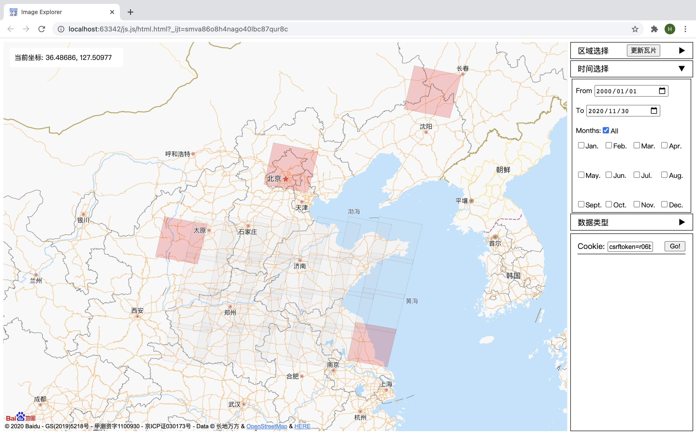
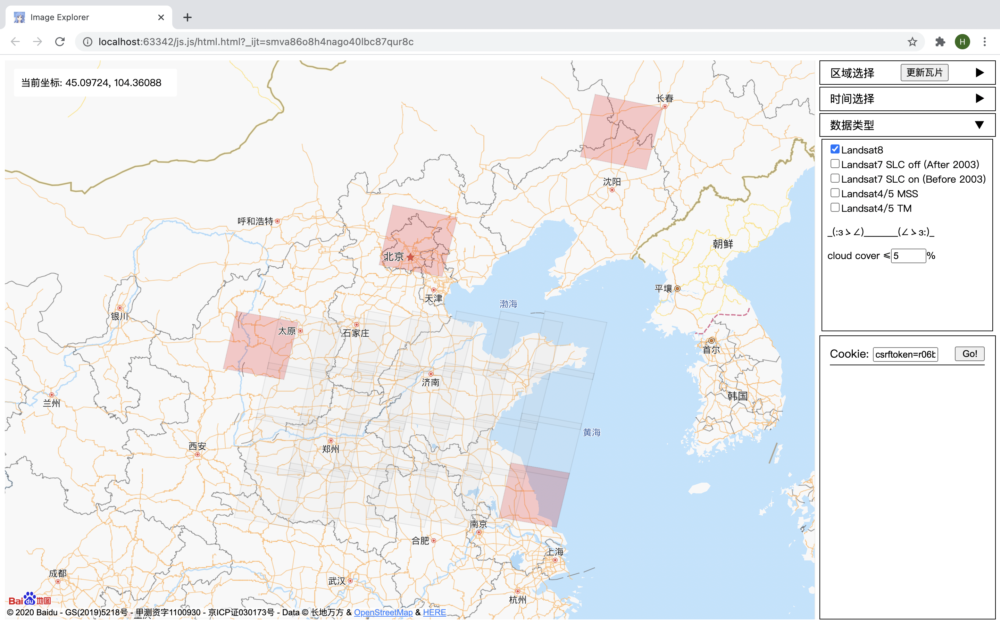

# 前言

本项目写于2020年冬，是一门课程的作业，现已年久失修大概率不能再用。如果API仍可使用，网页应该可以正常预览，但必须通过http协议访问网页。

# 选题背景

1. USGS网站的[EarthExplorer](https://earthexplorer.usgs.gov/)访问速度慢，下载速度慢，不支持断点下载。
2. [地理空间数据云(gscloud)](http://www.gscloud.cn/sources/)的Landsat系列数据较全，MODIS和Sentinel 1、2的数据也可以参考。
3. 地理空间数据云的数据筛选功能很弱鸡。

# 技术细节

- [Landsat影像数据行列号的划分方法](https://www.usgs.gov/media/files/landsat-wrs-2-corner-points)如下，详细的数值记录在`wrs.csv`文件中。

  

- 数据获取不再介绍。时隔多年，旧的爬取方式也许已经失效。当时还记了几个要点：
  1. 每隔几天，影像的url就会更新一次，所以不能保存影像url到本地，而是下载时实时查询；
  2. 清洗数据时注意脏数据，如空的云量；
  3. 转化数据时，注意json文件中string与number的引号区别，注意空格。

## 地图API

[百度地图API](http://lbsyun.baidu.com/index.php?title=jspopularGL)即使在海外也提供了地图数据，但API存在缺陷，即覆盖物的移动会造成内存泄漏。

（腾讯地图没有海外地图数据）

（高德地图也没有）

（内存泄漏）

## 网页渲染

采用[Vue.js](https://cn.vuejs.org)实现双向绑定，跨越HTML和JavaScript的隔阂。

- v-if/v-show: 条件渲染
- v-for: 列表循环
- v-model: 表单输入绑定
- v-on:click: 监听并执行JavaScript命令
  
  
  
  

## 数据库查询处理

- 使用[axios.js](http://www.axios-js.com)获取的object生成数据库；
  
- 使用[danfo.js](https://danfo.jsdata.org)（JavaScript的pandas）进行处理：
  - 查询(DataFrame.query())
  - 合并dfd.concat({df_list:[],axis:0})
  - 打印(DataFrame.print())
  - 选择列: DataFrame.column(), DataFrame.loc({rows:[], columns:[]}), DataFrame.iloc({rows:[], columns:[]})
  
  
  
- 致命缺陷: 
  - query查询结果若为空，则直接报错，因为不允许空的DataFrame存在。
  - Node.js端的代码bug较多，不便于调试

# 成果展示

1. 初始界面
   
2. 显示瓦片
   
3. 瓦片的懒加载
   
4. 更新瓦片
   
5. 选择瓦片
   
6. 瓦片的保留
   
7. 选择时间
   
8. 选择数据类型
   

# 未来展望

1. 使用MySQL存储并处理数据，而不是danfo.js。
   - danfo.js不能处理空的查询结果；
   - 浏览器的JavaScript引擎太弱了。
   
   
2. 使用Django / Rails等框架调用数据库，或者使用HTML5的Web SQL。
3. 增加区域选择的方式。
4. 自动更新gscloud的数据库。
5. 自动更新Cookie。
